# 요구사항 문서

열혈 사무소장과 개성 넘치는 인력원들 (가제) — 텍스트 기반 경영 시뮬레이션

| 항목        | 내용                           |
| ----------- | ------------------------------ |
| 문서 ID     | `REQ-GAME-001`                 |
| 버전        | `1.16.0`                       |
| 상태        | 초안 (Draft)                   |
| 최종 수정일 | 2026-06-15                     |
| 수정 이력   | [CHANGELOG.md](./CHANGELOG.md) |

> **문서 수정 규칙**
>
> - 요구사항 변경 시 본 문서를 수정하고, **반드시** [CHANGELOG.md](./CHANGELOG.md)에 날짜·버전·변경 유형·상세 내역을 기록한다.
> - 확정되지 않은 제안은 본문에 넣지 않고 [§12 보완 제안](#12-보완-제안-미확정) 또는 CHANGELOG `Proposed` 항목에 둔다.
> - 기획서 원문 대비 정리·구조화만 한 항목은 CHANGELOG `Added`로, 의미 변경은 `Changed`로 기록한다.

---

## 1. 게임 개요

| 항목        | 내용                                                                                                                                               |
| ----------- | -------------------------------------------------------------------------------------------------------------------------------------------------- |
| 가제        | 열혈 사무소장과 개성 넘치는 인력원들                                                                                                               |
| 장르        | 텍스트 기반 경영 시뮬레이션                                                                                                                        |
| 플랫폼      | PC / Mobile (텍스트 중심 UI)                                                                                                                       |
| 핵심 콘셉트 | 열혈적이지만 운영 능력은 부족한 사무소장과, 저마다 사연·개성을 가진 인력원들이 다양한 의뢰를 해결하며 사무소와 각 개인이 함께 성장해 나가는 이야기 |

### 1.1 플레이어 역할

플레이어는 사무소의 부족한 브레인을 채워주는 **총괄 매니저**이다.

**담당 업무**

- 인력원 스케줄 관리
- 의뢰 최적 배정
- 재화 관리
- 사무소 확장·홍보
- **인력 채용** ([§4.6](#46-채용인력-찾기))

### 1.2 매니저(플레이어) 능력치

매니저(플레이어)는 인력원과 동일한 **6대 주요 능력치**를 보유한다.

| 능력치 | 홍보·운영 관련 활용 예                  |
| ------ | --------------------------------------- |
| 피지컬 | (인력원 대비 우선도 낮음)               |
| 입담   | 홍보 미니게임·협상, 광고 업체 품질 판별 |
| 창의성 | 홍보 카피·영상 기획 관련                |
| 매력도 | 대외 홍보·의뢰인 대면                   |
| 사교성 | SNS·대행사 협상                         |
| 멘탈   | 고압 상황·연속 실패 대처                |

| 항목 | 규칙                                                                             |
| ---- | -------------------------------------------------------------------------------- |
| 성장 | **인력소(사무소) 성과**에 따라 매니저 능력치 상승                                |
| 활용 | 홍보 대행사 **우량 업체 식별**, 미니게임 난이도·보너스 등 ([§7](#7-홍보-시스템)) |

| ID          | 요구사항                                   | 우선순위 |
| ----------- | ------------------------------------------ | -------- |
| REQ-MGR-001 | 매니저는 6대 능력치 보유                   | Must     |
| REQ-MGR-002 | 사무소 성과에 따라 매니저 능력치 성장      | Must     |
| REQ-MGR-003 | 매니저 능력치는 홍보·대행사 판별·**의뢰 추천 근거**(§5.8)에 반영 | Must     |

---

## 2. 핵심 게임 루프

플레이어는 **매 턴(Turn)** 마다 인력원 상태를 확인하고, 각 인력원에게 스케줄을 지정한다. 턴 진행 결과로 의뢰 수주·수행·성장·휴식이 반영되고, 돌발 이벤트가 발생할 수 있다.


### 2.1 튜토리얼

신규 플레이어는 본편 시작 전 **4턴**의 가이드 시나리오를 진행한다.

| 항목      | 규칙                                             |
| --------- | ------------------------------------------------ |
| 등장 인원 | 사무소장 + 인력원 **1명** (튜토리얼 전용 구성)   |
| 턴 수     | **4턴** 고정                                     |
| 목적      | 스케줄 4종·의뢰 배정·턴 결과 처리 핵심 루프 학습 |
| 종료      | T4 완료 후 본편(일반 턴·전체 시스템) 해금        |

**턴 구성**

| 턴  | 학습 목표        | 내용                                                                                 |
| --- | ---------------- | ------------------------------------------------------------------------------------ |
| T1  | 의뢰 대기        | 의뢰 대기 스케줄 지정 → 간단 의뢰 1건 유입                                           |
| T2  | 의뢰 수행        | 인력원 배정·수행 결과·보상 확인                                                      |
| T3  | 휴식·성장        | 휴식 또는 성장 스케줄 지정·스탯 변화 확인                                            |
| T4  | 돌발 이벤트·목표 | 간단 선택형 이벤트 1회 → **첫 분기 장기 목표 제시** → **단기 목표 선택** → 본편 해금 |

| ID          | 요구사항                                                             | 우선순위 |
| ----------- | -------------------------------------------------------------------- | -------- |
| REQ-TUT-001 | 신규 게임 시작 시 4턴 튜토리얼 자동 진입                             | Must     |
| REQ-TUT-002 | 튜토리얼 중 등장 인원은 소장 + 인력원 1명으로 제한                   | Must     |
| REQ-TUT-003 | T1~T4 순서·학습 목표대로 가이드 UI/텍스트 제공 (T4에 목표 설정 포함) | Must     |
| REQ-TUT-004 | T4 완료 시 튜토리얼 종료·본편 진행 상태로 전환                       | Must     |
| REQ-TUT-005 | 튜토리얼 완료 여부 저장 (재시작 시 스킵 가능)                        | Should   |

### 2.2 목표 시스템

플레이어는 **장기 목표**(시스템 제시)와 **단기 목표**(플레이어 설정)를 병행한다. 주간 단위로 단기 목표를 수행하고, 4주마다 월간 보고서로 성과를 확인한다.

#### 2.2.1 시간 단위

| 단위                 | 기간          | 용도                    |
| -------------------- | ------------- | ----------------------- |
| **주 (Week)**        | 4주 = 1개월   | 단기 목표 1회 수행 주기 |
| **월 (Month)**       | 4주           | 월간 보고서 발행 시점   |
| **분기 (Quarter)**   | 3개월 (12주)  | 장기 목표 1단계         |
| **반기 (Half-year)** | 6개월 (24주)  | 장기 목표 2단계         |
| **연 (Year)**        | 12개월 (48주) | 장기 목표 3단계         |

> **1턴 = 1주**, 4턴 = 1개월 ([§2.4](#24-턴시간-체계)).

#### 2.2.2 장기 목표 — 단계별 해금

시스템이 제시하는 장기 목표. **연속 달성**으로 다음 단계가 해금된다.

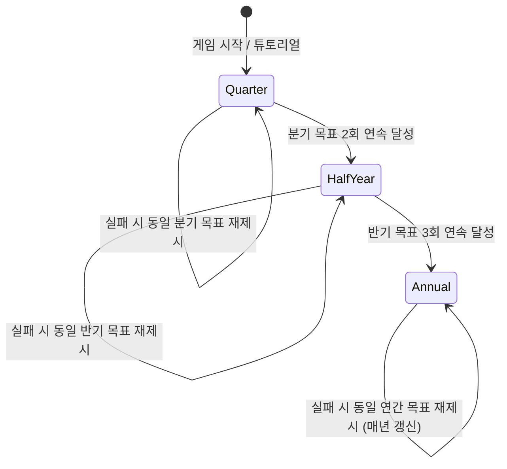

| 단계        | 기간  | 해금 조건                             | 실패 시                                           |
| ----------- | ----- | ------------------------------------- | ------------------------------------------------- |
| **1. 분기** | 3개월 | 초기 제공 (튜토리얼에서 첫 목표 제시) | 동일 분기 목표 재제시, 연속 달성 카운트 리셋      |
| **2. 반기** | 6개월 | 분기 목표 **2회 연속** 달성           | 동일 반기 목표 재제시, 연속 달성 카운트 리셋      |
| **3. 연간** | 1년   | 반기 목표 **3회 연속** 달성           | 동일 연간 목표 재제시, **매년** 새 연간 목표 갱신 |

#### 2.2.3 단기 목표 — 플레이어 설정

| 항목      | 규칙                                                        |
| --------- | ----------------------------------------------------------- |
| 설정 시점 | 장기 목표가 제시된 **직후** 플레이어가 설정                 |
| 주기      | **매주** 새 단기 목표 설정·수행                             |
| 실패      | 게임 오버 없음 (장기 목표와 별도)                           |
| 튜토리얼  | T4에서 첫 분기 장기 목표 확인 후 단기 목표 선택 → 본편 시작 |

#### 2.2.4 주간·월간 흐름

| 주기          | 동작                                                                     |
| ------------- | ------------------------------------------------------------------------ |
| **매주**      | 플레이어 설정 단기 목표 수행·결과 기록                                   |
| **4주 완료**  | **월간 보고서** — 지난 4주(1개월) 성과 요약 확인                         |
| **분기 종료** | 장기(분기) 목표 달성 여부 판정 → 성공 시 연속 카운트 +1 / 실패 시 재제시 |

#### 2.2.5 요구사항

| ID           | 요구사항                                                 | 우선순위 |
| ------------ | -------------------------------------------------------- | -------- |
| REQ-GOAL-001 | 장기 목표 3단계(분기→반기→연간) 및 연속 달성 해금 규칙   | Must     |
| REQ-GOAL-002 | 장기 목표 실패 시 동일 기간 목표 재제시·연속 카운트 리셋 | Must     |
| REQ-GOAL-003 | 장기 목표 제시 후 플레이어 단기 목표 설정 UI             | Must     |
| REQ-GOAL-004 | 매주 단기 목표 수행·결과 추적                            | Must     |
| REQ-GOAL-005 | 4주마다 월간 보고서(지난 4주 성과) 표시                  | Must     |
| REQ-GOAL-006 | 연간 목표는 달성/실패 후 매년 갱신                       | Must     |
| REQ-GOAL-007 | 튜토리얼 T4에서 첫 분기 목표 + 단기 목표 선택 포함       | Must     |
| REQ-GOAL-008 | 목표 진행 상태(단계·연속 달성 수) 저장                   | Must     |
| REQ-GOAL-009 | 장기·단기 목표 달성 시 보상 (재화/평판 등, 수치 TBD)     | Should   |

### 2.3 난이도 프리셋

신규 게임(또는 **엔딩 후 N회차**) 시작 시 난이도를 선택한다. **플레이 중 난이도 변경 불가.**

#### 2.3.1 프리셋 3종

| 프리셋       | 성장 기대치                       | 리스크·리턴                             | 이벤트         |
| ------------ | --------------------------------- | --------------------------------------- | -------------- |
| **캐주얼**   | 낮음 — 인력 성장·승급 기대치 완화 | 낮은 리스크, 보상·패널티 모두 완화      | 종류·빈도 적음 |
| **스탠다드** | 보통 — 기본 밸런스                | 기본 리스크·보상                        | 기본 이벤트 풀 |
| **하드**     | 높음 — 인력 성장·승급 기대치 상향 | 높은 리스크, **성공 시 보상 소폭 상향** | 종류·빈도 증가 |

- 난이도가 **낮을수록** 직원·사무소에 대한 **성장 기대치(목표·평가 기준)가 낮다.**
- 난이도가 **높을수록** 성장 기대치가 높고, 리스크 대비 **리턴(보상)이 소폭 증가**한다.

#### 2.3.2 의뢰·이벤트 티어 (Lv)

동일 콘텐츠도 **티어(Lv I ~ IV)** 로 난이도가 나뉜다. 프리셋별 **해금 티어 상한**과 **플레이어 선택**이 적용된다.

**예시: 「보디가드 임무」**

| 프리셋   | 해금 티어  | 플레이어 선택          |
| -------- | ---------- | ---------------------- |
| 캐주얼   | Lv I 만    | Lv I                   |
| 스탠다드 | Lv I, II   | Lv I 또는 II 중 선택   |
| 하드     | Lv III, IV | Lv III 또는 IV 중 선택 |

- 의뢰·돌발 이벤트 모두 동일 티어 체계 적용 ([TBD-017](#10-미정의-항목-tbd))
- 하드 프리셋은 이벤트 **가짓수**와 **티어 상한** 모두 증가

#### 2.3.3 회차(N회차) 진행

| 항목         | 규칙                                                 |
| ------------ | ---------------------------------------------------- |
| 난이도 변경  | **엔딩 열람 후**에만 가능                            |
| N회차 시작   | 엔딩 후 난이도 재선택 → 새 회차 시작                 |
| N회차 보너스 | [TBD-015](#10-미정의-항목-tbd) — 차후 수치·효과 정의 |

#### 2.3.4 요구사항

| ID           | 요구사항                                     | 우선순위 |
| ------------ | -------------------------------------------- | -------- |
| REQ-DIFF-001 | 신규 게임 시 캐주얼/스탠다드/하드 3종 선택   | Must     |
| REQ-DIFF-002 | 프리셋별 성장 기대치·리스크·보상 배율 차등   | Must     |
| REQ-DIFF-003 | 의뢰·이벤트 Lv I~IV 티어, 프리셋별 해금 상한 | Must     |
| REQ-DIFF-004 | 프리셋 내 해금된 티어 중 플레이어가 Lv 선택  | Must     |
| REQ-DIFF-005 | 하드일수록 이벤트 가짓수·발생 빈도 증가      | Must     |
| REQ-DIFF-006 | 플레이 중 난이도 변경 불가                   | Must     |
| REQ-DIFF-007 | 엔딩 후 난이도 변경·N회차 시작 가능          | Must     |
| REQ-DIFF-008 | N회차 보너스 (TBD-015 확정 후 반영)          | Should   |

### 2.4 턴·시간 체계

| 항목                         | 규칙                                                                                       |
| ---------------------------- | ------------------------------------------------------------------------------------------ |
| **기본**                     | **1턴 = 1주**                                                                              |
| **1개월**                    | **4턴** (= 4주, 목표·고정비·월간 보고서 주기와 일치)                                       |
| **턴 속도 옵션 (1턴=1개월)** | 반기 목표 **1회 이상** 달성 후 선택 가능                                                   |
| **N회차 옵션**               | 반기 목표 조건 **없이** 시작부터 1턴=1개월 선택 가능 ([REQ-DIFF-007](#234-회차n회차-진행)) |

| ID           | 요구사항                                                | 우선순위 |
| ------------ | ------------------------------------------------------- | -------- |
| REQ-TIME-001 | 기본 진행: 1턴 = 1주, 4턴 = 1개월                       | Must     |
| REQ-TIME-002 | 반기 목표 1회+ 달성 시 1턴=1개월 옵션 해금              | Should   |
| REQ-TIME-003 | N회차 시작 시 1턴=1개월 옵션 제공 (반기 조건 면제)      | Should   |
| REQ-TIME-004 | 턴 속도 옵션은 회차·세이브별 1회 선택 (중 변경 TBD-021) | Should   |

### 2.5 메인 스토리

본편 **메인 스토리**는 장기 목표(§2.2)와 **별도**로 진행한다. 각 스토리 구간은 **해금 조건이 충족될 때까지 대기**하며, 조건 미달 시 **강제 진행하지 않는다**.

#### 2.5.1 스토리 단계·해금 조건

장기 목표와 **동일한 연속 달성 구조**를 스토리 해금에 적용한다.

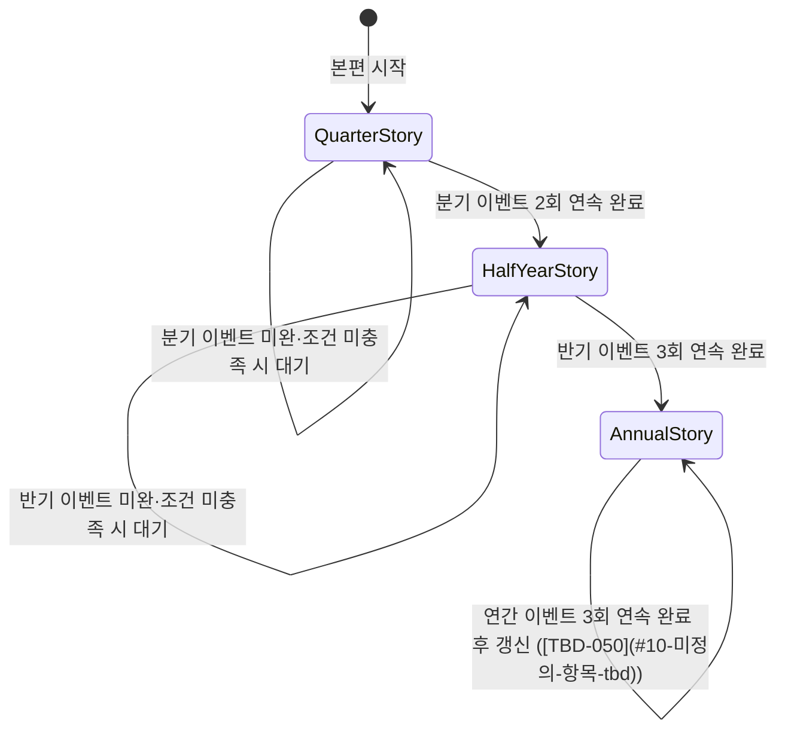

| 단계            | 기간  | 해금 조건                         | 미충족 시                         |
| --------------- | ----- | --------------------------------- | --------------------------------- |
| **1. 분기**     | 3개월 | 본편 시작 시 제공                 | 해당 구간 **대기** — 강제 진행 없음 |
| **2. 반기**     | 6개월 | 분기 이벤트 **2회 연속** 완료     | 반기 구간 **대기**                |
| **3. 연간**     | 1년   | 반기 이벤트 **3회 연속** 완료     | 연간 구간 **대기**                |
| **연간 갱신**   | 1년   | 연간 이벤트 **3회 연속** 완료     | 동일 연간 구간 유지·재시도 ([TBD-050](#10-미정의-항목-tbd)) |

- **분기·반기·연간 이벤트** — 메인 스토리 전용 이벤트 단위 (돌발 A/B/C와 별개, [TBD-050](#10-미정의-항목-tbd))
- 연속 완료 카운트는 **중간 실패·미완료 시 리셋** ([TBD-051](#10-미정의-항목-tbd) — 장기 목표와 동기화 여부)

#### 2.5.2 재정·패배 연동

메인 스토리 이벤트 진행에 **재정 지불**이 필요한 경우:

| 상황                     | 처리                                                                 |
| ------------------------ | -------------------------------------------------------------------- |
| 잔액 부족·지불 불가      | 해당 이벤트 **미진행** — 조건 충족 후에도 **대기** 유지              |
| 연속 지불 불가           | **연체 카운트** 누적 → [§8.3](#83-연체패배-파산-엔딩) 경고 단계 적용 |
| 12개월 연체 (또는 동등)  | **패배 엔딩** ([TBD-020](#10-미정의-항목-tbd))                       |

- 월간 고정비 연체와 **동일 카운터·경고 체계** 사용 여부 — [TBD-051](#10-미정의-항목-tbd)
- 메인 스토리 전용 비용·선택지 — [TBD-050](#10-미정의-항목-tbd)

#### 2.5.3 요구사항

| ID             | 요구사항                                                           | 우선순위 |
| -------------- | ------------------------------------------------------------------ | -------- |
| REQ-STORY-001  | 메인 스토리 3단계(분기→반기→연간) 및 연속 완료 해금                | Must     |
| REQ-STORY-002  | 해금 조건 미충족 시 해당 구간 **대기** — 강제 스킵 없음            | Must     |
| REQ-STORY-003  | 분기 2연속·반기 3연속·연간 3연속 완료 시 다음 단계 해금            | Must     |
| REQ-STORY-004  | 스토리 진행 상태(단계·연속 완료 수) 저장                           | Must     |
| REQ-STORY-005  | 재정 지불 불가 시 이벤트 미진행·연체 카운트·§8.3 경고 경유         | Must     |
| REQ-STORY-006  | 12개월 연체(또는 동등) 시 패배 엔딩                                | Must     |
| REQ-STORY-007  | 메인 스토리 UI — 대기 중 구간·해금 조건·연속 카운트 표시           | Should   |
| REQ-STORY-008  | 연쇄 의뢰(§5.6)·시즌(§5.7)와 독립 — 미완료여도 병행 수주·진행 가능 | Must     |

### 2.6 턴 요약·로그

턴이 종료될 때마다 해당 턴의 **전체 상세 로그**를 보관하고, 플레이어에게 **1~2줄 요약**을 제공한다. 과거 턴 로그는 **전체 기록**을 열람할 수 있으며, **필터**로 분류별 조회가 가능하다.

#### 2.6.1 턴 종료 시 요약

| 항목       | 규칙                                                                 |
| ---------- | -------------------------------------------------------------------- |
| 시점       | **매 턴 종료** 직후                                                  |
| 형식       | 해당 턴 핵심 결과를 **1줄 또는 2줄** 텍스트로 요약 ([TBD-057](#10-미정의-항목-tbd)) |
| 내용       | 의뢰 성공/실패, 이벤트, 재정 변동, 인력 상태 등 턴 내 주요 결과 포함 |
| 표시 방식  | 턴 종료 화면·토스트 등 ([TBD-058](#10-미정의-항목-tbd))              |

#### 2.6.2 턴 로그 보관·열람

| 항목       | 규칙                                                                 |
| ---------- | -------------------------------------------------------------------- |
| 보관 범위  | 지난 턴 **전체 상세 로그** — 턴별로 누적 보관 (**삭제·축약 없음**)  |
| 열람       | 별도 **로그 화면**에서 턴·항목별 상세 내역 조회                      |
| 필터       | 카테고리별 필터 적용 가능 ([TBD-059](#10-미정의-항목-tbd) — 분류 목록) |
| 저장       | 세이브 데이터에 로그 포함 ([REQ-NFR-003](#9-비기능-요구사항))        |

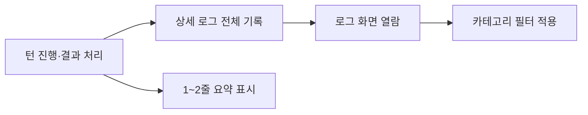

#### 2.6.3 요구사항

| ID           | 요구사항                                              | 우선순위 |
| ------------ | ----------------------------------------------------- | -------- |
| REQ-LOG-001  | 매 턴 종료 시 해당 턴 **상세 로그 전체** 보관         | Must     |
| REQ-LOG-002  | 매 턴 종료 시 **1~2줄 요약** 텍스트 제공              | Must     |
| REQ-LOG-003  | 로그 화면에서 과거 턴 **전체 기록** 열람              | Must     |
| REQ-LOG-004  | 로그 **카테고리 필터** 제공                           | Must     |
| REQ-LOG-005  | 턴 로그·요약을 세이브 데이터에 포함                   | Must     |
| REQ-LOG-006  | 요약·로그에 턴 번호·주(Week)·월 표시                  | Should   |
| REQ-LOG-007  | 필터 복수 선택·전체 보기 전환                         | Should   |

---

## 3. 스케줄 시스템

매 턴 인력원 1인당 아래 **스케줄 중 1개**를 지정한다. (기본 4종 + 해금 후 **홍보**)

| 스케줄        | 설명                                                              | 연관 시스템                                                       |
| ------------- | ----------------------------------------------------------------- | ----------------------------------------------------------------- |
| **의뢰 대기** | 새 의뢰 수주를 위해 사무소에서 상시 대기                          | 홍보·사무소 등급에 따라 대기 중 유입되는 의뢰 **질** 향상         |
| **의뢰 수행** | 소장·인력원이 현장 투입되어 사건 해결                             | 성공 시 재화, 경험치, 특수 아이템 보상                            |
| **휴식**      | 피로도·멘탈 회복                                                  | 관리 소홀 시 보이콧, 슬럼프 등 ([§4.5](#45-부상휴가-상태)와 별개) |
| **휴가**      | 휴가 — 부상 중이면 **부상 회복 전념** ([§4.5](#45-부상휴가-상태)) | 미부상 시 효과 [TBD-037](#10-미정의-항목-tbd)                     |
| **성장**      | 공부, 트레이닝, 승급 시험                                         | 성급(★)별 기준 능력치 충족 시 승급 시험 응시 가능                 |
| **홍보**      | 인력원이 홍보담당으로 활동 ([§7.3](#73-인력원-홍보-스케줄))       | 직접 발로 뛰기 / SNS / 영상 제작·업로드 ([§7](#7-홍보-시스템))    |

### 3.1 스케줄 관련 요구사항

| ID          | 요구사항                                                                   | 우선순위 |
| ----------- | -------------------------------------------------------------------------- | -------- |
| REQ-SCH-001 | 턴 단위로 인력원별 스케줄 1개 지정                                         | Must     |
| REQ-SCH-002 | 의뢰 대기 상태 인력원은 의뢰 유입 풀에 참여                                | Must     |
| REQ-SCH-003 | 의뢰 수행 중인 인력원은 동시에 다른 의뢰 불가 (동일 의뢰 다인 배정은 허용) | Must     |
| REQ-SCH-004 | 휴식 미배정·과로 시 돌발 이벤트 트리거 가능                                | Must     |
| REQ-SCH-005 | 성장 스케줄 중 승급 시험은 기준 능력치 충족 시만 가능                      | Must     |
| REQ-SCH-006 | 홍보 스케줄 해금 후 인력원 홍보담당 배정 가능                              | Must     |
| REQ-SCH-007 | 휴가 스케줄 지정 가능 — 부상 중이면 부상 회복 처리                         | Must     |
| REQ-SCH-008 | 부상 상태에서도 의뢰 수행 등 업무 배정 가능 (효율·실패률 패널티)           | Must     |

### 3.2 스케줄 보드 UI

인력원 스케줄을 **행·열 그리드**로 표시·편집하는 전용 화면이다. PC·태블릿은 그리드 중심, 모바일은 **리스트** 뷰를 제공한다 ([REQ-NFR-001](#9-비기능-요구사항)).

#### 3.2.1 그리드 (PC·태블릿)

| 항목   | 규칙                                                                 |
| ------ | -------------------------------------------------------------------- |
| 행     | **인력원** 1인당 1행                                                 |
| 열     | **주간 턴(Week)** — 열 1칸 = 1턴 ([TBD-060](#10-미정의-항목-tbd) — 표시 주 수) |
| 셀     | 해당 인력원·해당 턴에 지정된 **스케줄** 표시                         |

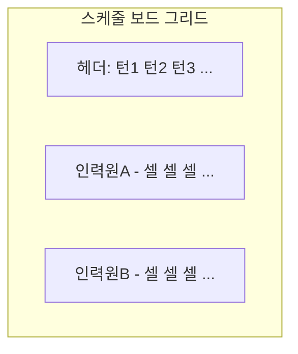

#### 3.2.2 스케줄 변경 입력 방식

| 방식            | 규칙                                                                 |
| --------------- | -------------------------------------------------------------------- |
| **드래그**      | **기본** — 스케줄 칩·셀을 드래그하여 다른 인력원·턴에 배치·이동     |
| **탭·선택**     | **옵션** — 설정에서 입력 방식 전환 시 사용 ([TBD-061](#10-미정의-항목-tbd)) |
| 설정            | 플레이어가 **드래그 / 탭·선택** 중 선택·전환 가능, 세이브에 유지     |

- 탭·선택 흐름: 셀 탭 → 스케줄 목록 선택 → 적용 ([TBD-061](#10-미정의-항목-tbd))
- 드래그·터치 모두 [REQ-NFR-002](#9-비기능-요구사항) 입력 지원 범위 내 구현

#### 3.2.3 모바일 리스트 뷰

| 항목           | 규칙                                                                 |
| -------------- | -------------------------------------------------------------------- |
| 레이아웃       | 좁은 화면에서는 **리스트** 형태로 스케줄 표시                        |
| 목록 필터      | **토글·드롭다운**으로 열람할 리스트 기준 전환 ([TBD-062](#10-미정의-항목-tbd)) |
| 필터 예시      | 인력원별 / 스케줄 유형별 / 턴(주)별 등 — 상세 목록은 TBD             |

#### 3.2.4 요구사항

| ID             | 요구사항                                                         | 우선순위 |
| -------------- | ---------------------------------------------------------------- | -------- |
| REQ-BOARD-001  | 스케줄 보드 — **인력원(행) × 주간 턴(열)** 그리드 표시           | Must     |
| REQ-BOARD-002  | 스케줄 변경 **기본 입력 = 드래그**                               | Must     |
| REQ-BOARD-003  | **탭·선택** 입력 방식을 설정 옵션으로 제공·전환 가능             | Must     |
| REQ-BOARD-004  | 입력 방식 설정 세이브 데이터에 저장                              | Should   |
| REQ-BOARD-005  | 모바일 **리스트** 뷰 제공                                        | Must     |
| REQ-BOARD-006  | 모바일 리스트 **토글·드롭다운**으로 목록 기준 필터               | Must     |
| REQ-BOARD-007  | 부상·휴가·의뢰 수행 등 상태를 셀·리스트에 시각 표시              | Should   |
| REQ-BOARD-008  | 그리드·리스트 간 동일 스케줄 데이터 동기화                       | Must     |

---

## 4. 캐릭터(인력원) 시스템

### 4.1 6대 주요 능력치

각 인력원은 6가지 능력치를 가지며, 의뢰 성공 확률 및 돌발 이벤트 결과에 영향을 준다.

| 능력치     | 설명                 | 대표 활용 예                               |
| ---------- | -------------------- | ------------------------------------------ |
| **피지컬** | 몸을 쓰는 일         | 경호, 짐 나르기, 추격, 잠입, 야근 버티기   |
| **입담**   | 말로 해결하는 일     | 협상, 취조, 변명, 홍보, 의뢰인 위로        |
| **창의성** | 기획·임기응변        | 작전 수립, 미궁 해결, 신분 위조, 돌발 우회 |
| **매력도** | 호감·시선            | 미인계, 정보 수집, VIP 만족도 관리         |
| **사교성** | 관계·융화            | 인맥 동원, 지역 정보 탐색, 팀 시너지 증폭  |
| **멘탈**   | 정신력·스트레스 저항 | 공포/압박 버티기, 실패 패널티 감소         |

| ID           | 요구사항                                          | 우선순위 |
| ------------ | ------------------------------------------------- | -------- |
| REQ-CHAR-001 | 인력원은 6대 능력치 스펙 보유                     | Must     |
| REQ-CHAR-002 | 능력치는 의뢰 성공률 계산에 사용                  | Must     |
| REQ-CHAR-003 | 능력치는 돌발 이벤트 선택지 성공/실패 판정에 사용 | Must     |

### 4.2 성급(★) 및 각성

| 항목        | 규칙                                                                               |
| ----------- | ---------------------------------------------------------------------------------- |
| 시작        | 모든 캐릭터 **1성(★)**                                                             |
| 승급 시험   | 성급별 **기준 능력치** 충족 시 응시 가능, 통과 시 다음 성급 각성·능력치 상한 확장  |
| 6성 초각성  | 5성 캐릭터가 **캐릭터별 히든 스토리 퀘스트·전용 의뢰** 등 특수 조건 달성 시만 가능 |
| 초각성 보상 | **초각성 고유 능력** 해금                                                          |

| ID           | 요구사항                                | 우선순위 |
| ------------ | --------------------------------------- | -------- |
| REQ-CHAR-004 | 성급 1~5는 승급 시험으로 단계 상승      | Must     |
| REQ-CHAR-005 | 6성은 캐릭터별 특수 조건 달성 후 초각성 | Must     |
| REQ-CHAR-006 | 초각성 시 고유 능력 1종 이상 해금       | Must     |

### 4.3 캐릭터 성향 (자동 매칭 분류)

의뢰 자동 배정 시 성향 매칭에 사용한다.

| 성향           | 선호 의뢰 유형        | 주요 능력치                        |
| -------------- | --------------------- | ---------------------------------- |
| **돌격대장**   | 위험·신체 활용        | 피지컬                             |
| **브레인**     | 조용한 지적·언어 해결 | 창의성, 입담                       |
| **마당발**     | 사람 상대·소통        | 사교성, 매력도                     |
| **강철심장**   | 고리스크·기괴 사건    | 멘탈                               |
| **귀차니스트** | 난이도 낮고 빠른 일   | (성향 무관, 난이도·소요 시간 우선) |

| ID           | 요구사항                                                             | 우선순위 |
| ------------ | -------------------------------------------------------------------- | -------- |
| REQ-CHAR-007 | 인력원은 1개 이상 성향 태그 보유                                     | Must     |
| REQ-CHAR-008 | 자동 2레벨 — **태그 우선**, 성향은 보조 ([§5.0](#50-의뢰-태그-체계)) | Should   |

### 4.4 호감도 시스템

캐릭터 간 **양방향 호감도**를 **0~100** 수치로 관리한다. 등급은 UI·이벤트 분기에 사용한다.

#### 4.4.1 호감도 관계 대상

| 관계                | 쌍                  |
| ------------------- | ------------------- |
| **인력원 ↔ 인력원** | 인력원끼리          |
| **매니저 ↔ 인력원** | 플레이어 ↔ 인력원   |
| **소장 ↔ 인력원**   | 사무소장 ↔ 인력원   |
| **소장 ↔ 매니저**   | 사무소장 ↔ 플레이어 |

#### 4.4.2 등급 (0~100)

| 등급     | 수치   | 설명        |
| -------- | ------ | ----------- |
| **낯섬** | 0~10   | 거의 모름   |
| **경계** | 11~20  | 불신·거리감 |
| **어색** | 21~35  | 아직 어색함 |
| **관심** | 36~50  | 관심 생김   |
| **호감** | 51~70  | 호감        |
| **친밀** | 71~90  | 친밀        |
| **신뢰** | 91~100 | 깊은 신뢰   |

#### 4.4.3 게임플레이 연동

| 연동            | 규칙                                                                                                  |
| --------------- | ----------------------------------------------------------------------------------------------------- |
| **의뢰 시너지** | 함께 의뢰 수행 시 호감도·[§5.2](#52-시너지-보너스) 반영 ([TBD-031](#10-미정의-항목-tbd))              |
| **링엘만·갈등** | 과잉 배치 시 갈등·이득 감소 ([§5.3](#53-링엘만-효과-과잉-배치))                                       |
| **슬럼프·잠적** | **소장↔매니저** 호감도 낮을 때 인력원 **사무소 이탈** 가능성↑ ([§6.2](#62-b타입-인력원-멘탈-및-케어)) |
| **헤드헌팅**    | **소장↔매니저** 호감도 낮을 때 인력원 **헤드헌팅** 발생·성공률↑                                       |
| **동료 설득**   | B타입 이벤트 성공 시 관련 인력 간 호감도↑                                                             |

#### 4.4.4 요구사항

| ID          | 요구사항                                    | 우선순위 |
| ----------- | ------------------------------------------- | -------- |
| REQ-AFF-001 | 4종 관계 쌍 모두 0~100 호감도 보유          | Must     |
| REQ-AFF-002 | 7단계 등급(낯섬~신뢰) UI 표시               | Must     |
| REQ-AFF-003 | 소장↔매니저 호감도↓ → 헤드헌팅·이탈 리스크↑ | Must     |
| REQ-AFF-004 | 의뢰·이벤트 결과에 따라 호감도 변동         | Must     |
| REQ-AFF-005 | 호감도 상태 저장·로드                       | Must     |

### 4.5 부상·휴가 (상태)

**부상**과 **휴가**는 서로 다른 **상태**이다. **휴식**(스케줄)과도 구분한다.

| 구분                   | 역할                                           |
| ---------------------- | ---------------------------------------------- |
| **휴식** (스케줄)      | 피로도·멘탈 회복                               |
| **휴가** (상태/스케줄) | 휴가 기간 — **부상 중**이면 부상 회복에 전념   |
| **부상** (상태)        | 신체·업무 부상 — **일은 계속 가능**하나 패널티 |

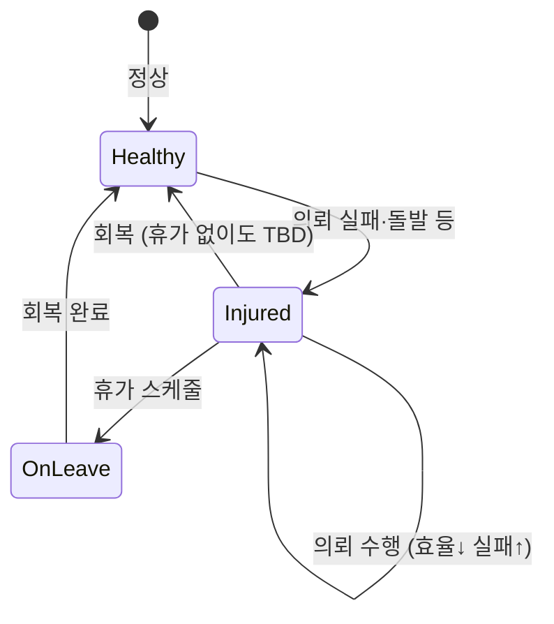

#### 4.5.1 부상 상태

| 항목   | 규칙                                                                     |
| ------ | ------------------------------------------------------------------------ |
| 업무   | **부상 중에도** 의뢰 수행·기타 스케줄 배정 **가능** (행동 불가 아님)     |
| 심각도 | 심각도별 **업무 효율↓**, **실패 확률↑** ([TBD-038](#10-미정의-항목-tbd)) |
| 발생   | 의뢰 실패·돌발 이벤트·고난도 의뢰 등 ([TBD-038](#10-미정의-항목-tbd))    |
| 상세   | 부상 종류·부위·지속 — **추후 상세** ([TBD-038](#10-미정의-항목-tbd))     |

#### 4.5.2 휴가 상태

| 항목        | 규칙                                                                                       |
| ----------- | ------------------------------------------------------------------------------------------ |
| 진입        | **휴가** 스케줄 지정 시 휴가 상태                                                          |
| 부상 + 휴가 | **부상 회복에 전념** — 해당 기간 업무 배정 불가 또는 제한 ([TBD-037](#10-미정의-항목-tbd)) |
| 회복 기간   | **부상 심각도**에 따라 휴가·회복 소요 **턴 수** 상이 ([TBD-038](#10-미정의-항목-tbd))      |
| 미부상 휴가 | 효과·기간 [TBD-037](#10-미정의-항목-tbd)                                                   |

#### 4.5.3 회복 보너스 (이벤트)

부상에서 회복할 때 **매우 낮은 확률**로 능력치가 오르는 **이벤트성 상승**이 발생할 수 있다.

| 예시           | 설명                                |
| -------------- | ----------------------------------- |
| 만성 피로 회복 | 장기 과로 후 적절 휴양              |
| 지병 치료      | 적절한 치료 병행으로 숨은 질환 개선 |

- 확률·상승량·대상 스탯 — [TBD-039](#10-미정의-항목-tbd)

#### 4.5.4 요구사항

| ID          | 요구사항                                  | 우선순위 |
| ----------- | ----------------------------------------- | -------- |
| REQ-INJ-001 | 부상·휴가를 별도 상태로 관리              | Must     |
| REQ-INJ-002 | 부상 중 업무 가능 — 심각도별 효율↓·실패↑  | Must     |
| REQ-INJ-003 | 부상 중 휴가 시 부상 회복 전념            | Must     |
| REQ-INJ-004 | 심각도별 회복(휴가) 기간 차등             | Must     |
| REQ-INJ-005 | 회복 시 매우 낮은 확률 능력치 이벤트 상승 | Should   |
| REQ-INJ-006 | 부상·휴가 상태 UI·턴 요약 표시            | Must     |

### 4.6 채용·인력 찾기

플레이어(매니저)는 **인력원 찾기** 및 **채용 이벤트**로 신규 인력을 확보한다.

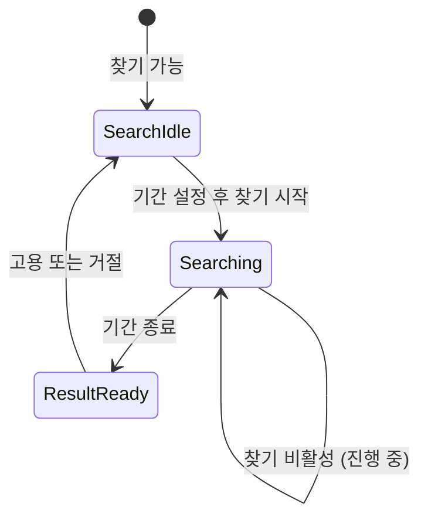

#### 4.6.1 인력원 찾기 (능동)

| 항목 | 규칙                                                                                 |
| ---- | ------------------------------------------------------------------------------------ |
| 실행 | **매 턴** 착수 가능 — 단, **진행 중에는 비활성**                                     |
| 기간 | 플레이어가 **1주·2주** 등 **임의 설정** ([TBD-040](#10-미정의-항목-tbd) — 최소·최대) |
| 진행 | 설정 기간(턴) 동안 **인력원 찾기 불가**                                              |
| 결과 | 기간 **종료 턴**에 후보 결과 공개 → **고용 / 거절** 선택                             |
| 재개 | 고용·거절 처리 후 **인력원 찾기 다시 활성**                                          |

- 1턴 = 1주 ([§2.4](#24-턴시간-체계)) — 2주 찾기 = 2턴

#### 4.6.2 채용 이벤트 유형

| 유형            | 설명                                      | 트리거                                                  |
| --------------- | ----------------------------------------- | ------------------------------------------------------- |
| **① 능동 찾기** | §4.6.1 — 기간 설정 → 결과 → 고용/거절     | 매니저 매 턴(비활성 기간 제외)                          |
| **② 정기 채용** | **상반기 1회·하반기 1회** 지원자가 찾아옴 | 정기 채용 활성화 ([TBD-041](#10-미정의-항목-tbd))       |
| **③ 긴급 채용** | 사무소 **레벨업·확장** 시 **선택** 진행   | 사무소 Lv↑·확장 이벤트 ([TBD-042](#10-미정의-항목-tbd)) |

- ②·③도 후보 확인 → 고용/거절 흐름 ([TBD-043](#10-미정의-항목-tbd) — ①과 UI 통합 여부)

#### 4.6.3 채용 비용·면접

| 항목          | 규칙                                                                     |
| ------------- | ------------------------------------------------------------------------ |
| **채용 비용** | 후보 **잠재 능력**에 따라 차등 ([TBD-044](#10-미정의-항목-tbd))          |
| **면접**      | 선택 시 진행 — **호감도 상승 미니게임** ([TBD-045](#10-미정의-항목-tbd)) |
| 면접 대상     | 매니저↔후보 **호감도** ([§4.4](#44-호감도-시스템))                       |

- 면접 없이 즉시 고용 가능 여부 — [TBD-043](#10-미정의-항목-tbd)

#### 4.6.4 요구사항

| ID           | 요구사항                            | 우선순위 |
| ------------ | ----------------------------------- | -------- |
| REQ-HIRE-001 | 인력원 찾기 — 기간(주) 임의 설정    | Must     |
| REQ-HIRE-002 | 찾기 진행 중 재착수 불가            | Must     |
| REQ-HIRE-003 | 기간 종료 후 결과·고용/거절 UI      | Must     |
| REQ-HIRE-004 | 고용/거절 후 찾기 재활성            | Must     |
| REQ-HIRE-005 | 정기 채용 — 상·하반기 각 1회        | Must     |
| REQ-HIRE-006 | 긴급 채용 — 사무소 Lv↑·확장 시 선택 | Must     |
| REQ-HIRE-007 | 채용 비용 = 잠재 능력 기반          | Must     |
| REQ-HIRE-008 | 면접 시 호감도 상승 미니게임        | Should   |
| REQ-HIRE-009 | 채용·찾기 진행 상태 저장            | Must     |

---

## 5. 의뢰 매칭 시스템

재화로 사무소 시스템을 업그레이드하며 매칭 방식을 확장한다. 후반부로 갈수록 수동 조작을 줄이고 전략적 관리에 집중하게 한다.

### 5.0 의뢰 태그 체계

의뢰는 **복수 태그**를 가질 수 있다. 태그는 **UI 필터·수동 배정·자동 매칭**에 사용한다. **자동 매칭**에서는 태그 일치를 **우선** 고려한다.

#### 5.0.1 태그 종류

| 종류            | 설명                               | 예시                                                                                               |
| --------------- | ---------------------------------- | -------------------------------------------------------------------------------------------------- |
| **능력치 태그** | 6대 능력치와 대응                  | `#신체` `#협상` `#기획` `#미인` `#네트워크` `#멘탈` ([TBD-047](#10-미정의-항목-tbd) — 공식 매핑表) |
| **독립 태그**   | 능력치와 **별도** — 의뢰 성격·테마 | `#기괴` `#VIP` `#야간` 등 ([TBD-046](#10-미정의-항목-tbd) — 전체 목록·효과)                        |

- 의뢰 1건에 **능력치 태그 + 독립 태그 복수** 부여 가능
- 인력원·성향(§4.3)과의 관계 — [TBD-048](#10-미정의-항목-tbd)

#### 5.0.2 자동 매칭에서의 태그 우선순위

| 단계           | 태그 반영                                                              |
| -------------- | ---------------------------------------------------------------------- |
| **자동 1레벨** | 없음 (랜덤)                                                            |
| **자동 2레벨** | 의뢰 태그 ↔ 인력 **태그 적합도 우선** ([TBD-048](#10-미정의-항목-tbd)) |
| **자동 3레벨** | 태그 적합 **우선** + 능력치·시너지 최적화                              |

- 성향(§4.3) 매칭은 태그 **이후** 보조 또는 [TBD-048](#10-미정의-항목-tbd)

#### 5.0.3 요구사항

| ID          | 요구사항                            | 우선순위 |
| ----------- | ----------------------------------- | -------- |
| REQ-TAG-001 | 의뢰당 복수 태그 (능력치·독립 혼합) | Must     |
| REQ-TAG-002 | 능력치 태그와 6대 스탯 대응         | Must     |
| REQ-TAG-003 | 독립 태그 별도 관리 (상세 TBD-046)  | Must     |
| REQ-TAG-004 | 자동 2·3레벨에서 태그 매칭 **우선** | Must     |
| REQ-TAG-005 | 의뢰 목록·배정 UI 태그 필터         | Should   |

### 5.1 다인 배정

**하나의 의뢰**에 **복수 인력원**을 동시에 배정할 수 있다.

| 항목   | 규칙                                                                             |
| ------ | -------------------------------------------------------------------------------- |
| 배정   | 의뢰 1건당 인력원 **2명 이상** 가능 ([TBD-035](#10-미정의-항목-tbd) — 최대 인원) |
| 판정   | 배정 인원의 능력치·고유 능력·호감도·**부상 패널티**를 종합해 성공률·보상 계산    |
| 스케줄 | 배정 인력원은 해당 턴 **의뢰 수행** 스케줄로 처리                                |

### 5.2 시너지 보너스

다인 배정 시 **능력치 조합·고유 능력(초각성 등)·호감도**에 따라 추가 보너스가 발생한다.

| 요소            | 효과 예                                                        |
| --------------- | -------------------------------------------------------------- |
| **능력치 상성** | 의뢰 요구 스탯을 팀원이 보완                                   |
| **고유 능력**   | 특정 조합 시 추가 성공률·보상 ([TBD-031](#10-미정의-항목-tbd)) |
| **호감도**      | 팀원 간 호감 등급↑ → 시너지↑ ([§4.4](#44-호감도-시스템))       |

- 적정 인원·조합일 때 **기대 이득 최대화**

### 5.3 링엘만 효과 (과잉 배치)

**혼자서 충분한 의뢰**에 인력을 **과하게** 투입하면, **매우 낮은 확률**로 부정 결과가 발생한다.

| 결과            | 설명                                        | 발생 확률                                  |
| --------------- | ------------------------------------------- | ------------------------------------------ |
| **링엘만 효과** | 인원은 많지만 **최대 이득(보상 상한) 감소** | 매우 낮음 ([TBD-032](#10-미정의-항목-tbd)) |
| **갈등·반목**   | 팀 내 마찰 → **이득 감소**, 호감도↓ 가능    | 매우 낮음                                  |
| **실패**        | 의뢰 **실패**                               | 매우 낮음                                  |

| 항목      | 규칙                                                                         |
| --------- | ---------------------------------------------------------------------------- |
| 과잉 판정 | 의뢰 난이도·권장 인원 대비 **초과 배치** 시 ([TBD-032](#10-미정의-항목-tbd)) |
| 확률      | 3종 모두 **매우 낮은 확률** — 남용 시에만 체감                               |
| UI        | 배정 화면에 **권장/과잉** 표시 ([TBD-032](#10-미정의-항목-tbd))              |

### 5.4 자동 매칭 단계

| 단계           | 방식      | 설명                                                                 | 해금            |
| -------------- | --------- | -------------------------------------------------------------------- | --------------- |
| **지정 매칭**  | 수동      | 플레이어가 의뢰 내용·요구 능력치를 보고 인력원 직접 배정 (다인 가능) | 기본 제공       |
| **자동 1레벨** | 랜덤      | 대기 인력원에게 남는 의뢰 무작위 배정. 효율 낮음, 정리 편리          | 업그레이드 해금 |
| **자동 2레벨** | 태그 매칭 | 의뢰 태그 ↔ 인력 적합도 **우선** 배정 ([§5.0](#50-의뢰-태그-체계))   | 업그레이드 해금 |
| **자동 3레벨** | 최적화    | **태그 우선** + 능력치·시너지 기반 최적 팀 AI 배정                   | 최종 해금       |

### 5.5 요구사항

| ID            | 요구사항                                         | 우선순위 |
| ------------- | ------------------------------------------------ | -------- |
| REQ-MATCH-001 | 지정 매칭은 초기부터 사용 가능                   | Must     |
| REQ-MATCH-002 | 자동 1~3레벨은 사무소 업그레이드로 순차 해금     | Must     |
| REQ-MATCH-003 | 자동 3레벨 — 태그 우선 + 능력치·시너지 최적 배정 | Should   |
| REQ-MATCH-004 | 매칭 방식은 플레이어가 턴마다 선택·전환 가능     | Could    |
| REQ-MATCH-005 | 의뢰 1건에 복수 인력원 배정 가능                 | Must     |
| REQ-MATCH-006 | 다인 배정 시 능력치·고유 능력 시너지 보너스      | Must     |
| REQ-MATCH-007 | 호감도가 팀 시너지에 반영                        | Must     |
| REQ-MATCH-008 | 과잉 배치 시 링엘만·갈등·저확률 실패             | Must     |
| REQ-MATCH-009 | 과잉 배치 UI 경고 (권장 인원 표시)               | Should   |

### 5.6 연쇄 의뢰 (옵션 보너스)

동일 의뢰인의 **후속 의뢰**로 이어지는 **옵션 보너스** 콘텐츠이다. 메인 스토리(§2.5)와 **독립**이며, 수주·스킵 여부는 플레이어 선택이다.

| 항목           | 규칙                                                                 |
| -------------- | -------------------------------------------------------------------- |
| 성격           | **옵션 보너스** — 메인 스토리·장기 목표 달성에 **필수 아님**         |
| 아크 구성      | 1아크당 **2~6건** 연속 — 아크 시작 시 **랜덤** 결정 ([TBD-052](#10-미정의-항목-tbd)) |
| 수주           | 선행 의뢰 성공 후 동일 의뢰인 **후속 의뢰** 유입                     |
| 중간 실패      | 해당 아크 **분기 엔딩** — 아크 종료 ([TBD-053](#10-미정의-항목-tbd)) |
| 아크 완주      | 연속 전부 성공 시 **보너스 보상**·스토리 결말 ([TBD-052](#10-미정의-항목-tbd)) |
| 메인 스토리    | 연쇄·시즌 진행이 메인 스토리 해금 조건에 **영향 없음**               |
| 시즌 이벤트    | 시즌(§5.7) 한정 의뢰와 **동시 수주·진행 가능**                       |

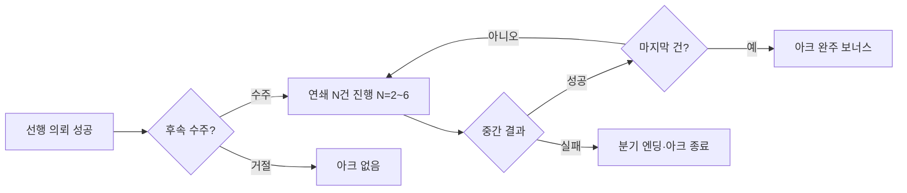

| ID            | 요구사항                                           | 우선순위 |
| ------------- | -------------------------------------------------- | -------- |
| REQ-CHAIN-001 | 연쇄 의뢰는 옵션 보너스 — 필수 진행 아님           | Must     |
| REQ-CHAIN-002 | 1아크당 2~6건 랜덤 연속                            | Must     |
| REQ-CHAIN-003 | 중간 실패 시 분기 엔딩으로 아크 종료               | Must     |
| REQ-CHAIN-004 | 메인 스토리·장기 목표·시즌(§5.7)과 진행 독립         | Must     |
| REQ-CHAIN-005 | 연쇄 의뢰 UI — 현재 N/M 진행·수주/거절 선택        | Should   |

### 5.7 시즌 이벤트

**게임 내 시즌** 단위로 한정 의뢰·한정 보상이 등장한다. 실제 달력과 **무관**하며, 턴 진행에 따라 시즌이 교체된다 ([TBD-054](#10-미정의-항목-tbd) — 시즌 길이·전환 시점).

| 항목           | 규칙                                                                 |
| -------------- | -------------------------------------------------------------------- |
| 시즌 단위      | **게임 내 시즌** — N턴(주) 주기 ([TBD-054](#10-미정의-항목-tbd))     |
| 한정 의뢰      | 해당 시즌에만 수주 가능한 의뢰                                       |
| 한정 보상      | 시즌 의뢰·이벤트 완료 시만 획득 가능한 보상 ([TBD-055](#10-미정의-항목-tbd)) |
| **미수주·미완료** | 시즌 종료 시 해당 한정 의뢰·보상 **영구 소실** — 재등장 없음          |
| 동시 진행      | 메인 스토리(§2.5)·연쇄 의뢰(§5.6)와 **동시 진행 가능**               |
| 필수 여부      | 시즌 콘텐츠는 **옵션** — 메인 스토리·장기 목표 달성에 필수 아님       |

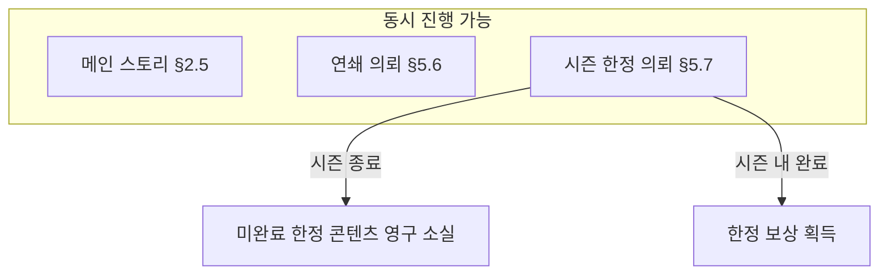

| ID             | 요구사항                                                         | 우선순위 |
| -------------- | ---------------------------------------------------------------- | -------- |
| REQ-SEASON-001 | 시즌은 게임 내 주기로 운영 (실제 달력 비연동)                    | Must     |
| REQ-SEASON-002 | 시즌 한정 의뢰·한정 보상 제공                                    | Must     |
| REQ-SEASON-003 | 시즌 종료 시 미수주·미완료 한정 콘텐츠 **영구 소실**             | Must     |
| REQ-SEASON-004 | 메인 스토리·연쇄 의뢰와 **동시 진행** 가능                       | Must     |
| REQ-SEASON-005 | 시즌 진행 상태·남은 기간·한정 의뢰 목록 UI ([TBD-056](#10-미정의-항목-tbd)) | Should   |
| REQ-SEASON-006 | 영구 소실된 한정 항목 기록(도감·회고) 표시 여부 ([TBD-055](#10-미정의-항목-tbd)) | Could    |

### 5.8 의뢰 상세 패널

의뢰 선택·배정 시 **단일 패널**에 요구 능력치, 등급, 성공률, 태그, 연쇄·시즌 정보, 추천 인력을 **통합 표시**한다.

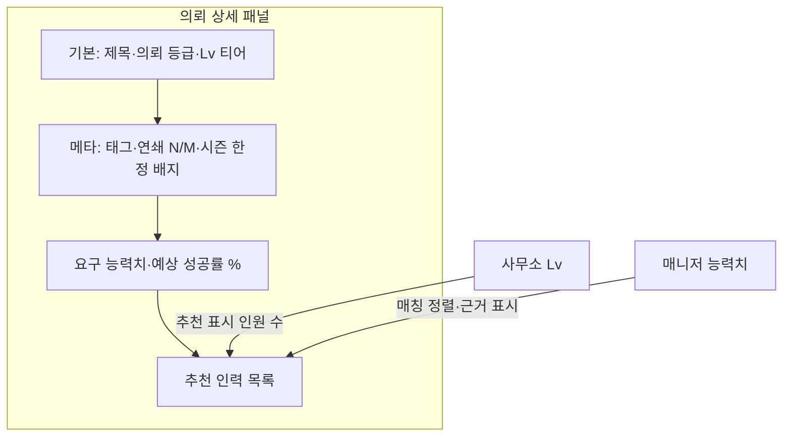

#### 5.8.1 패널 구성 (통합 표시)

| 영역           | 표시 내용                                                                 |
| -------------- | ------------------------------------------------------------------------- |
| **기본**       | 의뢰 제목·설명, **의뢰 등급**, Lv 티어(I~IV, [§2.3.2](#232-의뢰이벤트-티어-lv)) |
| **태그**       | 능력치·독립 태그 복수 ([§5.0](#50-의뢰-태그-체계))                        |
| **연쇄**       | 연쇄 의뢰 시 **N/M 진행**·아크 표시 ([§5.6](#56-연쇄-의뢰-옵션-보너스))   |
| **시즌**       | 시즌 한정 의뢰 시 **한정 배지**·남은 시즌 기간 ([§5.7](#57-시즌-이벤트))  |
| **능력치**     | 요구 6대 능력치·권장 인원                                                 |
| **성공률**     | **수치(%)** 로 예상 성공률 표시 — 배정 인원 변경 시 갱신                  |

#### 5.8.2 의뢰 등급

난이도·희소성을 나타내는 **등급 체계**. 초기 4단계이며 **추후 확장 가능**하다.

| 등급 (초기) | 순서 |
| ----------- | ---- |
| **일반**    | 1    |
| **희귀**    | 2    |
| **특별**    | 3    |
| **중요**    | 4    |

- Lv 티어(I~IV)와 **별개** — 동일 의뢰에 등급·티어가 함께 부여될 수 있음 ([TBD-063](#10-미정의-항목-tbd))
- 추가 등급 정의·UI 색상 — [TBD-063](#10-미정의-항목-tbd)

#### 5.8.3 예상 성공률

| 항목   | 규칙                                                           |
| ------ | -------------------------------------------------------------- |
| 표시   | **백분율 수치(%)** — 소수·반올림 규칙은 [TBD-066](#10-미정의-항목-tbd) |
| 갱신   | 추천·배정 인력 변경 시 **실시간** 재계산                       |
| 근거   | 배정 인원 능력치·시너지·부상·태그·성향 등 종합 ([§5.1~§5.3](#51-다인-배정)) |

#### 5.8.4 추천 인력

**사무소 레벨**과 **매니저 능력치**가 역할을 **분리**한다.

| 주체             | 역할                                                                 |
| ---------------- | -------------------------------------------------------------------- |
| **사무소 Lv**    | 패널에 표시할 **추천 인력 수** — Lv↑ 시 인원 **증가** ([TBD-064](#10-미정의-항목-tbd)) |
| **매니저 능력치** | 추천 목록 **정렬** 및 **매칭 근거** 표시 정밀도 ([§1.2](#12-매니저플레이어-능력치), [TBD-065](#10-미정의-항목-tbd)) |

| 매니저 능력 수준 | 추천 동작                                                                 |
| ---------------- | ------------------------------------------------------------------------- |
| **낮음**         | 사무소 Lv만큼 인력 표시 — **기본 정렬**(요구 능력치 합산 등)              |
| **높음**         | 동일 인원 수 내 **태그·성향 매칭 근거** 노출 — 매칭도 **상위 순** 정렬   |

- 태그·성향 근거 **해금 임계값** — 매니저 6대 능력치·사무소 성과 기반 ([TBD-065](#10-미정의-항목-tbd), [REQ-MGR-002](#12-매니저플레이어-능력치))
- 근거 예: `#협상` 태그 일치, 성향「협상가」적합 등

#### 5.8.5 요구사항

| ID              | 요구사항                                                         | 우선순위 |
| --------------- | ---------------------------------------------------------------- | -------- |
| REQ-PANEL-001   | 의뢰 상세 **단일 패널**에 태그·연쇄·시즌·능력치·성공률 통합 표시 | Must     |
| REQ-PANEL-002   | 예상 성공률 **수치(%)** 표시                                     | Must     |
| REQ-PANEL-003   | 의뢰 등급 일반·희귀·특별·중요 (확장 가능 구조)                   | Must     |
| REQ-PANEL-004   | 사무소 Lv에 따라 추천 인력 **표시 인원 수** 증가                 | Must     |
| REQ-PANEL-005   | 매니저 능력치에 따라 추천 **정렬·태그·성향 매칭 근거** 표시      | Must     |
| REQ-PANEL-006   | 배정 변경 시 성공률·추천 목록 실시간 갱신                        | Must     |
| REQ-PANEL-007   | 연쇄 N/M·시즌 한정 배지 시각 구분                               | Should   |
| REQ-PANEL-008   | 매니저 능력 미달 시 근거 숨김·기본 정렬만 제공                   | Should   |

---

## 6. 돌발 이벤트 시스템

스케줄 진행 중 무작위 발생. 플레이어(매니저)의 **선택지**와 능력치·자원 조건에 따라 결과가 갈린다.

### 6.1 [A타입] 열혈 소장 관련 트러블

| 이벤트                  | 상황                                    | 선택지 예시                                                                  |
| ----------------------- | --------------------------------------- | ---------------------------------------------------------------------------- |
| **내가 다 해결하겠소!** | 소장이 지시 무시, 고난도 의뢰 단독 출근 | ① 타 인력원 급파 수습 (자금 소모) / ② 소장 열정 신뢰 (대성공 or 대실패·부상) |
| **소장의 엉뚱한 홍보**  | 괴상한 굿즈·단체 티셔츠 대량 주문       | ① 매니저 입담으로 환불 (입담 요구) / ② 인력원 강제 착용 (매력도↓, 사교성↑)   |

### 6.2 [B타입] 인력원 멘탈 및 케어

> **호감도 연동**: **소장↔매니저** 호감도가 낮으면 아래 이벤트 **발생·심화** 가능 ([§4.4.3](#443-게임플레이-연동))

| 이벤트            | 상황                             | 선택지 예시                                                                                                                             |
| ----------------- | -------------------------------- | --------------------------------------------------------------------------------------------------------------------------------------- |
| **슬럼프와 잠적** | 연속 실패로 멘탈 붕괴, 무단 이탈 | ① 매니저 직접 위로·식사 (자금, 멘탈 회복) / ② 사교성 높은 동료 설득 (동료 사교성·**호감도** 요구) — 실패·저호감 시 **사무소 이탈** 가능 |
| **헤드헌팅**      | 에이스 인력원 스카웃 제의 인지   | ① 연봉 인상 (정기 지출↑) / ② 진심 호소 (매력·사교성 요구, 실패 시 이탈) — **소장↔매니저** 저호감 시 발생률↑                             |

### 6.3 [C타입] 의뢰 중 돌발 상황

| 이벤트                        | 상황                                                     | 선택지 예시                                                                                                       |
| ----------------------------- | -------------------------------------------------------- | ----------------------------------------------------------------------------------------------------------------- |
| **의뢰인의 황당한 추가 요구** | 현장에서 의뢰 스케일 급증 (예: 길고양이 → 호랑이 사육장) | ① 안전 철수 (의뢰 실패, 패널티 없음) / ② 추가 수당 요구 후 강행 (피지컬·창의성, 성공 시 보상 3배, 실패 시 대부상) |

| ID          | 요구사항                                                   | 우선순위 |
| ----------- | ---------------------------------------------------------- | -------- |
| REQ-EVT-001 | 돌발 이벤트는 A/B/C 타입으로 분류                          | Must     |
| REQ-EVT-002 | 이벤트마다 2개 이상 선택지 제공                            | Must     |
| REQ-EVT-003 | 선택지는 능력치·자원 조건 및 확률/결과 분기                | Must     |
| REQ-EVT-004 | 이벤트 결과는 인력원 스탯·재화·의뢰·**호감도** 상태에 반영 | Must     |
| REQ-EVT-005 | B타입 이벤트는 소장↔매니저 호감도에 따라 가중              | Must     |

### 6.4 이벤트 연출 (텍스트·결과)

선택지 기반 내러티브 이벤트(§6.1~6.3) 및 메인 스토리(§2.5) 등 **텍스트 선택·결과 공개**에 공통 적용한다.

#### 6.4.1 선택 전후 텍스트

| 항목       | 규칙                                                                 |
| ---------- | -------------------------------------------------------------------- |
| diff 방식  | **변경된 문장만 교체** — 전후 본문에서 달라진 문장을 새 텍스트로 치환 |
| 비교 표시  | 추가·삭제 줄 강조(diff 하이라이트) **사용하지 않음**                  |
| 미변경 문장 | 그대로 유지·표시                                                     |

- 문장 단위 분할·교체 규칙 — [TBD-067](#10-미정의-항목-tbd)

#### 6.4.2 스탯·자원 변화 표시

| 항목       | 규칙                                                                 |
| ---------- | -------------------------------------------------------------------- |
| 표시 시점  | **결과 확정 시** — 선택지 처리 후 결과 화면                            |
| 표시 내용  | **증감량만** — `+3`, `-5` 등 변화량 수치 ([TBD-068](#10-미정의-항목-tbd)) |
| 표시 대상  | 능력치·호감도·재화 등 이벤트로 변동된 항목                             |
| 비표시     | 변동 없는 스탯·최종 절대값은 기본 숨김 (필요 시 TBD)                   |

#### 6.4.3 연출 속도

| 항목           | 규칙                                                                 |
| -------------- | -------------------------------------------------------------------- |
| **기본**       | **타이핑 효과** + 문장·결과 **순차 공개**                            |
| **2회차 이상** | **즉시 전체 공개** 옵션 제공 — 설정에서 선택·세이브 유지 ([§2.3.3](#233-회차n회차-진행)) |
| 1회차          | 즉시 공개 옵션 **미제공** (기본 연출만)                              |

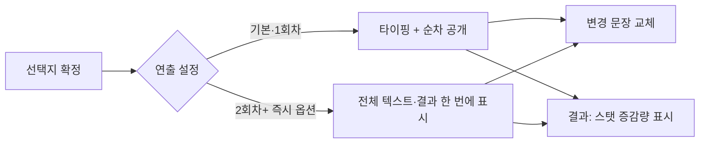

#### 6.4.4 요구사항

| ID              | 요구사항                                                         | 우선순위 |
| --------------- | ---------------------------------------------------------------- | -------- |
| REQ-NARR-001    | 선택 전후 텍스트 — **변경 문장만 교체** (줄 단위 diff 미사용)    | Must     |
| REQ-NARR-002    | 결과 시 스탯·자원 **증감량(±)** 만 표시                          | Must     |
| REQ-NARR-003    | 기본 연출 — **타이핑 + 순차 공개**                               | Must     |
| REQ-NARR-004    | **2회차 이상** 플레이 시 **즉시 전체 공개** 설정 옵션            | Must     |
| REQ-NARR-005    | 연출 속도 설정 세이브·회차별 유지                                | Should   |
| REQ-NARR-006    | 순차 공개 중 스킵(탭·클릭)으로 현재 블록 완료 ([TBD-069](#10-미정의-항목-tbd)) | Should   |
| REQ-NARR-007    | 메인 스토리·돌발 이벤트 동일 연출 규칙 적용                      | Must     |

---

## 7. 홍보 시스템

홍보는 **단기 효과**만 부여한다. 긍정·부정 효과 모두 가능하며, **영구적 홍보 강화**는 [업적(§7.5)](#75-영구-홍보-강화-업적)으로만 달성한다.

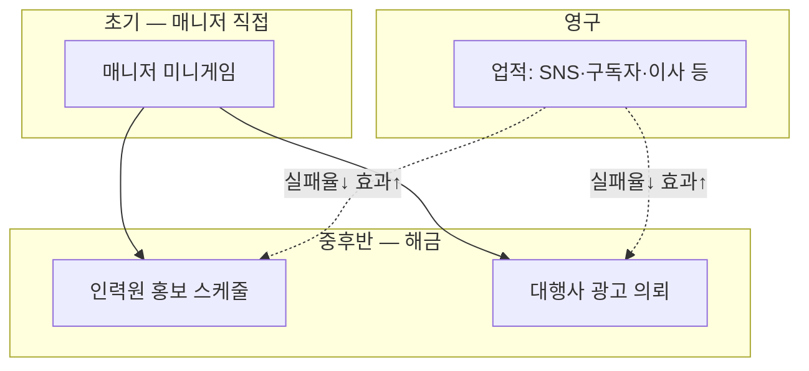

### 7.1 홍보 효과 원칙

| 구분          | 범위           | 긍정                            | 부정                           |
| ------------- | -------------- | ------------------------------- | ------------------------------ |
| **단기 효과** | 해당 턴~수 턴  | 의뢰 질·유입↑, 평판↑ 등         | 의뢰 질↓, 평판↓, 역효과 이벤트 |
| **영구 효과** | 업적 달성 시만 | 홍보 성공률↑, 역효과·실패 확률↓ | —                              |

- 홍보로 **의뢰 대기** 품질·유입에 단기 보너스/페널티 적용 ([TBD-023](#10-미정의-항목-tbd))
- 영구 업그레이드는 **SNS 팔로우·영상 구독자·사무실 이사** 등 업적 기반 ([§7.5](#75-영구-홍보-강화-업적))

### 7.2 매니저 직접 홍보 — 미니게임 (초기)

게임 초반 홍보는 매니저가 **직접 발로 뛰는** 형태로, **미니게임**으로 진행한다.

| 미니게임      | 설명                                   | 결과                                |
| ------------- | -------------------------------------- | ----------------------------------- |
| **타자 게임** | 제한 시간 내 홍보 문구 타자 입력       | 단기 긍정 효과 (강도는 점수에 비례) |
| **클릭 게임** | 긍정 홍보 단어만 클릭 (부정 단어 회피) | 단기 긍정 효과                      |

| 항목   | 규칙                                                                                                          |
| ------ | ------------------------------------------------------------------------------------------------------------- |
| 역효과 | 매니저 미니게임은 **역효과(홍보 실패·평판 하락) 없음** — 최소 neutral, 주로 긍정                              |
| 해금   | 중후반 **인력원 홍보·대행사 광고** 해금 후에도 매니저 미니게임 **선택 가능** ([TBD-024](#10-미정의-항목-tbd)) |

**추가 미니게임 후보** (낮은 우선순위, [TBD-LOW-001](#91-낮은-우선순위-tbd))

### 7.3 인력원 홍보 (스케줄)

인력원에게 **홍보** 스케줄을 배정하면 홍보담당으로 활동한다.

| 활동                      | 설명          | 관련 능력치 (예)     |
| ------------------------- | ------------- | -------------------- |
| **직접 발로 뛰기**        | 현장 홍보     | 입담, 매력도, 사교성 |
| **SNS 활용**              | SNS 게시·홍보 | 사교성, 창의성, 입담 |
| **홍보 영상 제작·업로드** | 영상 콘텐츠   | 창의성, 입담, 매력도 |

- 담당 인력원의 **6대 능력치가 높을수록** 좋은 결과 확률↑ ([TBD-025](#10-미정의-항목-tbd))
- 결과는 **4단계**: **대성공 · 성공 · 실패 · 역효과** (리스크 있음)

### 7.4 대행사 광고 (비용만)

인력원 없이 **재화(비용)만** 지불해 광고 대행사에 홍보를 의뢰한다.

| 항목      | 규칙                                                                                            |
| --------- | ----------------------------------------------------------------------------------------------- |
| 비용      | 일회성 광고비 ([TBD-026](#10-미정의-항목-tbd))                                                  |
| 결과      | **대성공 · 성공 · 실패 · 역효과** (인력 홍보와 동일 4단계)                                      |
| 업체 판별 | **매니저 능력치**에 따라 우량/불량 대행사 **식별 정확도** 상이 ([TBD-027](#10-미정의-항목-tbd)) |
| 리스크    | 고비용·저품질 업체 선택 시 역효과 가능                                                          |

### 7.5 영구 홍보 강화 (업적)

다음 **업적 달성** 시에만 영구적으로 홍보 관련 수치가 개선된다.

| 업적 유형       | 예시                      | 영구 효과 (예)              |
| --------------- | ------------------------- | --------------------------- |
| **SNS**         | 일정 **팔로우 수** 달성   | 홍보 성공률↑, 역효과 확률↓  |
| **영상 플랫폼** | 일정 **구독자 수** 달성   | 동상                        |
| **사무소**      | **더 좋은 사무실로 이사** | 홍보 효과 배율↑, 실패 확률↓ |

- 임계값·수치는 [TBD-028](#10-미정의-항목-tbd)
- 업적은 **누적·영구** — 단기 홍보와 별도 레이어

### 7.6 요구사항

| ID            | 요구사항                                          | 우선순위 |
| ------------- | ------------------------------------------------- | -------- |
| REQ-PROMO-001 | 홍보 효과는 단기(턴/주 단위)만 적용               | Must     |
| REQ-PROMO-002 | 초기 홍보는 매니저 미니게임(타자·클릭)으로만 진행 | Must     |
| REQ-PROMO-003 | 매니저 미니게임은 역효과 없음                     | Must     |
| REQ-PROMO-004 | 해금 후 인력원 홍보 스케줄(발로 뛰기/SNS/영상)    | Must     |
| REQ-PROMO-005 | 해금 후 대행사 광고(비용만, 인력 불필요)          | Must     |
| REQ-PROMO-006 | 인력 홍보·대행사는 대성공/성공/실패/역효과 4단계  | Must     |
| REQ-PROMO-007 | 인력 홍보 결과는 담당자 6대 능력치 반영           | Must     |
| REQ-PROMO-008 | 대행사 품질 판별은 매니저 능력치 반영             | Must     |
| REQ-PROMO-009 | 영구 강화는 SNS·구독자·이사 등 업적으로만         | Must     |
| REQ-PROMO-010 | 업적 달성 시 홍보 성공률↑·실패/역효과율↓          | Should   |

---

## 8. 재화·경제·패배

### 8.1 고정비 (월간)

**매월(4턴)** 말에 아래 항목을 **자동 차감**한다.

| 항목            | 포함 내용                                                  |
| --------------- | ---------------------------------------------------------- |
| **사무실**      | 대여료·임대료                                              |
| **인건비**      | 인력원 급여 (인원 수 연동, [TBD-019](#10-미정의-항목-tbd)) |
| **세금·공과금** | 전기세 등 ([TBD-019](#10-미정의-항목-tbd))                 |

### 8.2 대출 시스템

| 항목 | 규칙                                                                 |
| ---- | -------------------------------------------------------------------- |
| 발동 | 월간 고정비 차감 후 **잔액 부족** 시                                 |
| 용도 | 고정비·운영비 충당 ([TBD-018](#10-미정의-항목-tbd) — 이자·상환·한도) |

### 8.3 연체·패배 (파산 엔딩)

고정비·대출 상환 등으로 **연속 연체** 시 경고 단계를 거쳐 **패배 엔딩**으로 분기한다.

| 연체 기간        | 단계      | 결과                                                |
| ---------------- | --------- | --------------------------------------------------- |
| **1개월**        | 1차 경고  | 경고 UI·텍스트                                      |
| **3개월**        | 2차 경고  | 강화 경고                                           |
| **6개월**        | 최종 경고 | 마지막 경고                                         |
| **12개월 (1년)** | 패배      | **패배 엔딩** 분기 ([TBD-020](#10-미정의-항목-tbd)) |

- 연체 카운트는 **연속** 미납 개월 기준 (중간 정상 납부 시 리셋 여부: [TBD-022](#10-미정의-항목-tbd))
- **메인 스토리** 재정 지불 불가도 동일 연체·경고 체계에 반영 ([§2.5.2](#252-재정패배-연동), [TBD-051](#10-미정의-항목-tbd))

### 8.4 요구사항

| ID           | 요구사항                                        | 우선순위 |
| ------------ | ----------------------------------------------- | -------- |
| REQ-ECON-001 | 매월(4턴) 고정비 자동 차감 (임대료·인건비·세금) | Must     |
| REQ-ECON-002 | 잔액 부족 시 대출 시스템 이용                   | Must     |
| REQ-ECON-003 | 연체 1·3·6·12개월 단계별 경고                   | Must     |
| REQ-ECON-004 | 12개월 연체 시 패배 엔딩                        | Must     |
| REQ-ECON-005 | 월간 정산·연체 상태 UI 표시                     | Must     |

---

## 9. 비기능·기술 요구사항

### 9.1 UI·접근성 (비기능)

| ID          | 요구사항                               | 우선순위 |
| ----------- | -------------------------------------- | -------- |
| REQ-NFR-001 | 텍스트 중심 UI (PC·Mobile 공통)        | Must     |
| REQ-NFR-002 | 모바일 터치·PC 키보드/마우스 입력 지원 | Should   |
| REQ-NFR-003 | 게임 상태 로컬 저장 (세션 이어하기) — [§9.2.2](#922-상태-저장-localstorage) | Should   |
| REQ-NFR-004 | 접근성: 버튼·선택지 키보드 조작 가능   | Should   |

### 9.2 기술 아키텍처 (React 웹게임)

React **UI 레이어**와 **게임 규칙·판정 로직**을 분리한다. 밸런스 데이터는 코드 밖에서 관리한다.

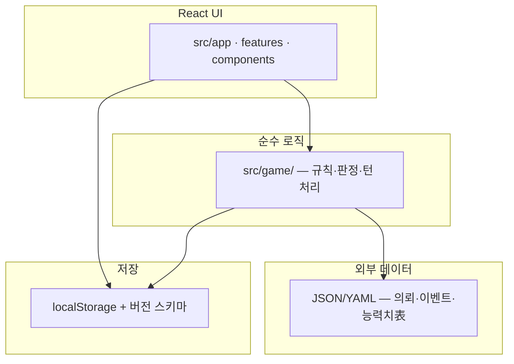

#### 9.2.1 게임 로직 분리 (`src/game/`)

| 항목       | 규칙                                                                 |
| ---------- | -------------------------------------------------------------------- |
| 위치       | **`src/game/`** — 턴 진행, 의뢰 판정, 경제·목표·이벤트 결과 등 **순수 함수** |
| UI 분리    | `src/app`, `src/features`, `src/components` — **표시·입력만** 담당   |
| 의존성     | `src/game`은 React·DOM에 **의존하지 않음**                           |
| 테스트     | 게임 로직은 UI 없이 단위 테스트 가능 구조 ([TBD-072](#10-미정의-항목-tbd)) |
| 타입       | 공유 타입은 `src/types/` — 게임 상태·API 경계 명시                   |

권장 하위 구조 예 ([TBD-072](#10-미정의-항목-tbd)):

```
src/game/
  engine/      # 턴·스케줄 오케스트레이션
  rules/       # 의뢰·이벤트·경제 판정
  models/      # 상태 변환 (불변 업데이트)
  data/        # 밸런스 로더·검증 (파일은 src/data/ 등)
```

#### 9.2.2 상태 저장 (`localStorage`)

| 항목           | 규칙                                                                 |
| -------------- | -------------------------------------------------------------------- |
| 저장소         | **`localStorage`** — 브라우저 로컬 세이브                             |
| 스키마 버전    | 세이브 페이로드에 **`schemaVersion`** 필드 필수                       |
| 마이그레이션   | 버전 불일치 시 **마이그레이션 함수**로 이전 스키마 → 현재 스키마 변환 ([TBD-070](#10-미정의-항목-tbd)) |
| 저장 범위      | 게임 상태, 턴 로그(§2.6), 설정(연출 속도·입력 방식 등), 회차 정보    |
| 실패 처리      | 파싱·마이그레이션 실패 시 안내 UI·새 게임 제안 ([TBD-070](#10-미정의-항목-tbd)) |

- 구현 보조 모듈 위치 — `src/lib/` (저장·로드·마이그레이션 헬퍼)

#### 9.2.3 밸런스 데이터 외부화

| 항목       | 규칙                                                                 |
| ---------- | -------------------------------------------------------------------- |
| 형식       | **JSON 또는 YAML** — 콘텐츠 유형별 선택 ([TBD-071](#10-미정의-항목-tbd)) |
| 외부화 대상 | 의뢰 풀, 돌발·메인 스토리 이벤트, 능력치·등급·태그表, 난이도·보상 수치 등 |
| 로딩       | 빌드 시 번들 또는 런타임 fetch — [TBD-071](#10-미정의-항목-tbd)       |
| 검증       | 로드 시 스키마·필수 필드 검증 — 잘못된 데이터는 개발 빌드에서 오류 표시 |
| 코드 분리  | 밸런스 수치 **하드코딩 금지** — `src/game`은 데이터 파일만 참조        |

#### 9.2.4 요구사항

| ID            | 요구사항                                                         | 우선순위 |
| ------------- | ---------------------------------------------------------------- | -------- |
| REQ-TECH-001  | 게임 규칙·판정은 `src/game/` 순수 함수로 구현                    | Must     |
| REQ-TECH-002  | React 컴포넌트는 UI·입력만 — 판정 로직 직접 포함 금지            | Must     |
| REQ-TECH-003  | `src/game`은 React/DOM 비의존                                     | Must     |
| REQ-TECH-004  | 세이브는 `localStorage` + `schemaVersion`                        | Must     |
| REQ-TECH-005  | 스키마 변경 시 마이그레이션 경로 제공                            | Must     |
| REQ-TECH-006  | 의뢰·이벤트·능력치 등 밸런스를 JSON/YAML로 외부화                | Must     |
| REQ-TECH-007  | 밸런스 로드·검증 레이어 분리                                     | Should   |
| REQ-TECH-008  | 개발 규칙 — [.cursorrules](../../.cursorrules), [React SKILL](../../.cursor/react/SKILL.md) 준수 | Must     |

---

## 10. 미정의 항목 (TBD)

기획서에 명시되지 않아 **구현 전 확정이 필요한** 항목이다.

| ID      | 항목             | 질문 / 결정 필요 사항                                                      |
| ------- | ---------------- | -------------------------------------------------------------------------- |
| TBD-002 | 재화 종류        | 단일 화폐 vs 운영비/홍보비 분리?                                           |
| TBD-003 | 사무소장         | §4.4·TBD-036 참조 — NPC·스케줄·의뢰 참여 여부                              |
| TBD-004 | 인력원 수        | 초기·최대 고용 인원, 거절 후 재등장 여부 ([§4.6](#46-채용인력-찾기))       |
| TBD-005 | 의뢰 생성        | 풀 크기, 난이도 분포, **등급·태그 부여 규칙**, 성공·실패 판정 공식        |
| TBD-006 | 피로도·멘탈      | 수치 범위, **휴식** 회복량, 임계값 (부상·휴가와 별개)                      |
| TBD-007 | 사무소 등급      | Lv·확장, 긴급 채용·이사 업적 연동 ([§4.6](#46-채용인력-찾기), §7.5)        |
| TBD-008 | 승급 시험        | 시험 성공률, 실패 패널티, 시도 횟수 제한                                   |
| TBD-009 | 6성 조건         | 캐릭터별 히든 퀘스트 상세 목록                                             |
| TBD-010 | 호감도 변동      | 증감 이벤트·수치表, 초기값, 소장↔매니저 시작값 ([§4.4](#44-호감도-시스템)) |
| TBD-011 | 기타 패배 조건   | 핵심 인력 전원 이탈 등 (파산 외)                                           |
| TBD-012 | 스토리 진행      | 메인 스토리 챕터·엔딩 — [§2.5](#25-메인-스토리), [TBD-050](#10-미정의-항목-tbd) |
| TBD-013 | 목표 보상        | 장기/단기/월간 보고서 달성 보상 수치                                       |
| TBD-014 | 단기 목표 풀     | 플레이어 자유 입력 vs 프리셋 목록에서 선택                                 |
| TBD-015 | N회차 보너스     | 엔딩 후 회차별 누적 보너스 수치·효과                                       |
| TBD-016 | 성장 기대치      | 프리셋별 승급·목표·평가 기준 수치                                          |
| TBD-017 | 의뢰·이벤트 티어 | Lv I~IV별 요구 능력치·보상·이벤트 풀 데이터                                |
| TBD-018 | 대출 상세        | 이자율, 상환 주기, 최대 대출액, 연체 시 이자                               |
| TBD-019 | 고정비 수치      | 임대료·인건비·전기세 등 월별 금액, 난이도별 차등 여부                      |
| TBD-020 | 패배 엔딩        | 12개월 연체 패배 엔딩 분기·텍스트·연출                                     |
| TBD-021 | 턴 속도 옵션 UX  | 1턴=1개월 전환 시점 UI, 회차 중 변경 가능 여부                             |
| TBD-022 | 연체·상환 규칙   | 부분 납부 시 연체 리셋, 대출·고정비 우선순위                               |
| TBD-023 | 홍보 단기 효과   | 턴/주 단위 지속, 의뢰 품질·평판 수치화                                     |
| TBD-024 | 홍보 해금 순서   | 인력 홍보·대행사·미니게임 병행 시점                                        |
| TBD-025 | 인력 홍보 판정   | 활동별 가중 능력치, 4단계 결과 확률表                                      |
| TBD-026 | 대행사 광고      | 업체별 비용·품질·히든 스탯, 광고비 구간                                    |
| TBD-027 | 대행사 식별      | 매니저 능력치별 식별률·UI (입담/사교성 등)                                 |
| TBD-028 | 홍보 업적        | SNS 팔로우·구독자·이사 단계별 임계값·영구 보너스                           |
| TBD-029 | 매니저 성장      | 사무소 성과→능력치 상승 공식·상한                                          |
| TBD-030 | 미니게임 난이도  | 타자·클릭 난이도 curve, 매니저 스탯 연동                                   |
| TBD-031 | 시너지 조합      | 고유 능력·스탯 조합별 보너스表, 호감도 등급별 계수                         |
| TBD-032 | 링엘만·과잉      | 권장 인원 정의, 3종 부정 결과 확률·cap 수치                                |
| TBD-033 | 호감도 이벤트    | 의뢰 공동 수행·갈등·케어 선택지별 ±값                                      |
| TBD-034 | 소장↔매니저      | 저호감 시 헤드헌팅·이탈 가중 공식                                          |
| TBD-035 | 다인 배정 상한   | 의뢰당 최소·최대 인원, 의뢰 유형별 권장 인원                               |
| TBD-036 | 소장 NPC         | 소장 스탯·호감도 주체, 스케줄·의뢰 참여 여부                               |
| TBD-037 | 휴가 (미부상)    | 미부상 휴가 효과·기간, 업무 제한 범위                                      |
| TBD-038 | 부상 상세        | 심각도 단계, 종류·부위, 발생 조건, 효율/실패 패널티·회복 턴수表            |
| TBD-039 | 회복 보너스      | 능력치 이벤트 상승 확률·종류 (만성 피로, 지병 치료 등)                     |
| TBD-040 | 찾기 기간        | 최소·최대 주(턴), 동시 진행 1건만 여부                                     |
| TBD-041 | 정기 채용        | 상·하반기 정의(턴/월), 활성화 조건, 지원자 수·품질                         |
| TBD-042 | 긴급 채용        | Lv업·확장별 후보 풀, 필수/선택, ① 찾기와 동시 진행 규칙                    |
| TBD-043 | 채용 UX          | 3유형 UI 통합, 면접 생략 가능 여부, 거절 시 페널티                         |
| TBD-044 | 잠재 능력·비용   | 잠재 능력 정의, 등급별 채용비·연봉 연동                                    |
| TBD-045 | 면접 미니게임    | 종류, 호감도 상승량, 실패 시 영향                                          |
| TBD-046 | 독립 태그        | 전체 목록, 의미, 매칭·성공률·UI 표시 규칙                                  |
| TBD-047 | 능력치 태그      | 6대 스탯 ↔ 태그 ID 공식 매핑表, 다국어 라벨                                |
| TBD-048 | 태그 자동 매칭   | 2·3레벨 가중치, 성향과 우선순위, 인력 태그 보유 규칙                       |
| TBD-049 | 태그 UI          | 필터·색상·아이콘, 복수 태그 표시 방식                                      |
| TBD-050 | 메인 스토리 상세 | 분기·반기·연간 이벤트 목록, 텍스트·비용·선택지, 연간 갱신 규칙             |
| TBD-051 | 스토리·연체 연동 | 메인 스토리 비용과 월간 고정비 연체 카운터 통합 여부, 리셋 규칙            |
| TBD-052 | 연쇄 아크        | 2~6 랜덤 분포, 후속 유입 조건, 완주 보너스 수치                            |
| TBD-053 | 연쇄 분기 엔딩   | 중간 실패 시 분기 엔딩 종류·텍스트·보상/패널티                             |
| TBD-054 | 시즌 주기        | 게임 내 시즌 길이(턴/주), 전환 시점·알림, 시즌 테마 로테이션               |
| TBD-055 | 시즌 한정 콘텐츠 | 한정 의뢰·보상 목록, 영구 소실 후 도감·회고 기록 여부                      |
| TBD-056 | 시즌 UI          | 남은 시즌 기간, 한정 의뢰 배지, 종료 임박·소실 경고                        |
| TBD-057 | 턴 요약 생성     | 1~2줄 요약 우선순위·문장 템플릿, 복수 이벤트 동시 발생 시 병합 규칙        |
| TBD-058 | 턴 요약 표시 UX  | 요약 표시 위치(모달·토스트·패널), 자동 닫힘·다시 보기                       |
| TBD-059 | 로그 필터 분류   | 필터 카테고리 목록(의뢰·이벤트·재정·인력·홍보·스토리·시즌 등), 복수 선택   |
| TBD-060 | 스케줄 보드 그리드 | 표시할 주(턴) 열 수, 스크롤·고정 행/열, 과거 턴 열람 여부                |
| TBD-061 | 스케줄 입력 UX   | 드래그 제스처·스냅, 탭·선택 단계 UI, 접근성 대체 입력                     |
| TBD-062 | 모바일 리스트 필터 | 드롭다운 목록 기준(인력원별·스케줄별·턴별 등), 토글 UI 상세                |
| TBD-063 | 의뢰 등급        | 일반·희귀·특별·중요 외 추가 등급, Lv 티어와 매핑·UI 색상                   |
| TBD-064 | 추천 인원 수     | 사무소 Lv별 추천 표시 인원 수表                                            |
| TBD-065 | 추천 매칭 근거   | 매니저 능력치별 태그·성향 근거 해금 임계값, 정렬 가중치                    |
| TBD-066 | 성공률·패널 UI   | 성공률(%) 계산·반올림, 패널 레이아웃·모바일 접기                           |
| TBD-067 | 이벤트 문장 교체 | 문장 분할 단위, 변경 문장 판별·교체 애니메이션                             |
| TBD-068 | 스탯 증감 표시   | ± 표기·색상·정렬, 호감도·재화 등 항목별 포맷                               |
| TBD-069 | 연출 속도 UX     | 타이핑 속도, 순차 공개 단계, 스킵·즉시 공개 전환 UI                        |
| TBD-070 | 세이브 마이그레이션 | schemaVersion 규칙, 단계별 마이그레이션 함수, 손상 세이브 처리          |
| TBD-071 | 밸런스 데이터    | JSON/YAML 파일 경로·형식, 빌드 번들 vs fetch, 콘텐츠별 분할              |
| TBD-072 | game 폴더 구조   | engine/rules/models 하위 모듈 경계, 공개 API 표면                        |

### 10.1 낮은 우선순위 TBD

구현·기획 **후순위** 후보. MVP 이후 검토.

| ID          | 항목                | 설명                                                                                     |
| ----------- | ------------------- | ---------------------------------------------------------------------------------------- |
| TBD-LOW-001 | 홍보 미니게임 추가  | **OX 퀴즈**(사무소 소개), **카드 짝맞추기**(긍정 슬로건), **리듬 탭**(캐치프레이즈 박자) |
| TBD-LOW-002 | 홍보 A/B 테스트     | 두 카피 중 선택해 다음 턴 효과 비교                                                      |
| TBD-LOW-003 | 바이럴 이벤트       | SNS 홍보 대성공 시 일시적 폭주 유입 (리스크 동반)                                        |
| TBD-LOW-004 | 호감도 일일 대화    | 턴 시작 시 인력원과 짧은 대화로 소량 호감도↑ (텍스트 선택지)                             |
| TBD-LOW-005 | 라이벌 관계         | 특정 인력원 쌍 고정 **경쟁** 관계 — 동일 의뢰 시 갈등 확률 소폭↑                         |
| TBD-LOW-006 | 찾기 중 매니저 행동 | 찾기 진행 중 매니저만 다른 업무(홍보 미니게임 등) 가능 여부                              |

---

## 11. 용어 정의

| 용어               | 정의                                                                  |
| ------------------ | --------------------------------------------------------------------- |
| 턴 (Turn)          | 스케줄 일괄 지정·결과 처리 단위. 기본 **1턴=1주**, 옵션 **1턴=1개월** |
| 고정비             | 매월 자동 차감되는 임대료·인건비·세금·공과금                          |
| 연체               | 고정비·대출 등 미납이 누적된 개월 수                                  |
| 의뢰 (Request)     | 사무소가 수주·수행하는 업무 단위 — **복수 태그** 보유 가능            |
| 능력치 태그        | 6대 스탯과 대응하는 의뢰 태그                                       |
| 독립 태그          | 능력치와 무관한 의뢰 테마·성격 태그 ([TBD-046](#10-미정의-항목-tbd)) |
| 메인 스토리        | 분기→반기→연간 단계별 본편 스토리 ([§2.5](#25-메인-스토리))           |
| 연쇄 의뢰          | 동일 의뢰인 후속 의뢰 아크 — 옵션 보너스 ([§5.6](#56-연쇄-의뢰-옵션-보너스)) |
| 시즌 (게임 내)     | 턴 기반 한정 기간 — 한정 의뢰·보상 ([§5.7](#57-시즌-이벤트))                 |
| 한정 의뢰          | 특정 시즌에만 수주 가능 — 미완료 시 **영구 소실**                            |
| 턴 로그            | 턴별 **전체 상세 기록** — 필터로 분류 열람 ([§2.6](#26-턴-요약로그))         |
| 턴 요약            | 턴 종료 시 해당 턴 결과 **1~2줄** 요약 텍스트                                |
| 스케줄 보드        | 인력원(행)×주간 턴(열) 그리드·모바일 리스트 ([§3.2](#32-스케줄-보드-ui))     |
| 의뢰 등급          | 일반·희귀·특별·중요 — 확장 가능 ([§5.8.2](#582-의뢰-등급))                   |
| 의뢰 상세 패널     | 의뢰 정보·태그·연쇄·시즌·성공률·추천 인력 통합 UI ([§5.8](#58-의뢰-상세-패널)) |
| 이벤트 연출        | 변경 문장 교체·스탯 증감·타이핑 순차 공개 ([§6.4](#64-이벤트-연출-텍스트결과)) |
| 게임 로직 (`src/game/`) | React와 분리된 순수 함수 규칙·판정 레이어 ([§9.2.1](#921-게임-로직-분리-srcgame)) |
| 분기 엔딩 (아크)   | 연쇄 의뢰 중간 실패 시 해당 아크 전용 결말 ([TBD-053](#10-미정의-항목-tbd)) |
| 성급 (★)           | 인력원 성장 단계 (1~6성)                                              |
| 초각성             | 5성에서 6성으로의 특수 각성                                           |
| 성향               | 자동 매칭용 캐릭터 분류 태그                                          |
| 돌발 이벤트        | 스케줄 진행 중 발생하는 선택형 내러티브 이벤트                        |
| 난이도 프리셋      | 캐주얼 / 스탠다드 / 하드 — 신규·회차 시작 시 선택, 중 변경 불가       |
| 의뢰·이벤트 티어   | 동일 콘텐츠의 Lv I~IV 난이도 단계                                     |
| 홍보               | 단기적으로 의뢰·평판에 영향. 매니저 미니게임 / 인력 / 대행사 경로     |
| 홍보 역효과        | 홍보 실패로 평판·의뢰 품질 하락 (매니저 미니게임 제외)                |
| 대행사 광고        | 비용만 지불하는 외주 홍보                                             |
| 홍보 업적          | SNS·구독자·이사 등 영구 홍보 강화 조건                                |
| 호감도             | 캐릭터 간 0~100 관계 수치 (낯섬~신뢰 7등급)                           |
| 시너지             | 다인 의뢰 시 능력치·고유 능력·호감도 기반 추가 보너스                 |
| 링엘만 효과        | 과잉 배치 시 최대 이득 감소·갈등·저확률 실패                          |
| 부상               | 별도 상태 — 업무 가능, 심각도별 효율↓·실패↑                           |
| 휴가               | 별도 상태 — 부상 중이면 부상 회복 전념                                |
| 인력원 찾기        | 기간 설정 후 진행 — 종료 시 후보·고용/거절                            |
| 정기 채용          | 상·하반기 각 1회 지원자 유입 이벤트                                   |
| 긴급 채용          | 사무소 Lv↑·확장 시 선택 가능한 채용 이벤트                            |
| 잠재 능력          | 후보 성장 가능성 — 채용 비용 산정 기준                                |
| 회차 (Playthrough) | 엔딩 후 난이도 재선택으로 시작하는 새 플레이 사이클                   |

---

## 12. 보완 제안 (미확정)

아래는 기획서에 없으나 **추가하면 좋을 내용**으로, 확정 시 본문에 편입하고 CHANGELOG에 기록한다.

### 12.1 인력·관계

_(현재 미확정 제안 없음 — §4.4~§4.6으로 승격 완료)_

### 12.2 의뢰·콘텐츠

_(현재 미확정 제안 없음 — §5.0·§5.6·§5.7으로 승격 완료)_

### 12.3 UI/UX (텍스트 중심)

_(현재 미확정 제안 없음 — §2.6·§3.2·§5.8·§6.4로 승격 완료)_

### 12.4 기술 (React 웹게임)

_(현재 미확정 제안 없음 — §9.2로 승격 완료)_

---

## 13. 관련 문서

| 문서                                                      | 설명                 |
| --------------------------------------------------------- | -------------------- |
| [CHANGELOG.md](./CHANGELOG.md)                            | 요구사항 수정 이력   |
| [../.cursorrules](../../.cursorrules)                     | 프론트엔드 개발 규칙 |
| [../.cursor/react/SKILL.md](../../.cursor/react/SKILL.md) | React 성능 가이드    |
